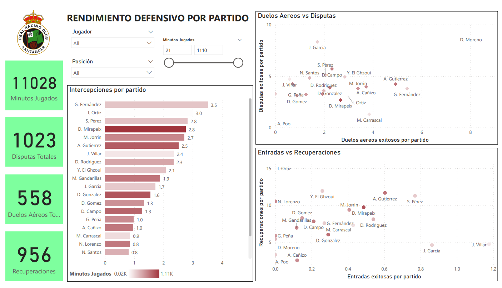

### **MASTER'S PROJECT - REAL RACING CLUB DE SANTANDER**

Master Degree Big Data in Sports - Universidad Católica San Antonio de Murcia (UCAM)

#python #powerbi

------

*In this README file, I will summarize the main aspects from the final project I did for Real Racing Club de Santander, specifically for the Rayo Cantabria team, where I processed their raw data using Python and created a dashboard using Power BI to visualize their performance in the season 2020-2021.* 

*It is important to acknowledge that I am not going to upload the data I used for this project because the rights of this data belong to Real Racing Club, however, I will upload the python scripts I created to process the data and the PDF of the dashboard created using Power BI.*

------

**INTRODUCTION**

"Data is the new science. Big Data are the answers". Under this premise I began to work on this project, which has two aspects: a purely academic one related to the implementation of all the knowledge and skills learned during the master's degree, and another more professional aspect, consisting of the creation of a Big Data department in a professional soccer club. This last aspect it is because Real Racing Club had barely enter in the data analysis world, in fact, this 2020-2021 season it was the first season when they implemented the Bepro11 software in the club, a software that gather match data and then create some graphs in their app. But I wanted to dive deep and to get a better advantage from that data using Python and Power BI.

**DATA INGESTION, TREATMENT AND CLEANING PROCESS**

**DATA INGESTION**

As I already mentioned to carry out this project I will focus specifically on the data of the Real Racing Club affiliate team, Rayo Cantabria. The club provided a Bepro11 account so that I can have access to the data of Rayo's home matches, this is because Bepro11 collects the information through the cameras that are installed in the field and that is why this project will only analyze data from home games. There two type of data:

<u>General statistics</u>

This data was obtained from the Bepro11 app, where it is stored by type of statistic: offensive, distribution and defensive data per match, where each of them it's an individual CSV file. Variables from the three type of statistic:

- Common variables: 'Num.', 'Name', 'Pos.', 'Rating', 'Minutes Played'.

- Offensive: 'Goals', 'Assists', 'Shots', 'Shots On Target', 'Blocked Shots', 'Shots Off Target', 'Shots Inside PA', 'Shots Outside PA', 'Offsides', 'Freekicks', 'Corners', 'Throw-Ins', 'Take-Ons Success', 'Take-Ons Total'.

- Distribution: 'Passes Success', 'Passes Total', 'Pass Accuracy(%)', 'Key Passes', 'Passes In Final Third Success', 'PassesInFinalThird Total', 'Passes In Middle Third Success', 'PassesInMiddleThird Total', 'Passes In Defensive Third Success', 'PassesInDefensiveThird Total', 'Long Passes Success', 'LongPasses Total', 'Medium Range Passes Success', 'MediumRangePasses Total', 'Short Passes Success', 'ShortPasses Total', 'Passes Forward Success', 'PassesForward Total', 'Passes Sideways Success', 'PassesSideways Total', 'Passes Backward Success', 'PassesBackward Total', 'Crosses Success', 'Crosses Total', 'Control Under Pressure'.

- Defensive: 'Tackles Success', 'Tackles Total', 'Aerial Duels Success', 'AerialDuels Total', 'Ground Duels Success', 'GroundDuels Total', 'Interceptions', 'Clearances', 'Interventions', 'Recoveries', 'Blocks', 'Mistakes', 'Fouls', 'Fouls Won', 'Yellow Cards', 'Red Cards'.

<u>Event data</u>

This data was obtained via email, because downloading was not available through the page, so your request was necessary directly with those in charge of the app in Spain. The variables available in each CSV file per match were: 

- 'id', 'match_id', 'match_full_time', 'extra_full_time', 'player_id', 'back_number', 'player_name', 'team_id', 'team_name', 'event_time', 'event_period', 'is_side_changed', 'event_types', 'filtered_event_types', 'x', 'y', 'relative_player_id', 'relative_player_name', 'end_x', 'end_y'. 

**TREATMENT AND CLEANING PROCESS USING PYTHON**

For the treatment and cleaning of data process, two python files have been created: ImportData.py and concatDF.py, where both are true to their name, since the first has functions that are mainly responsible for importing the data, both general statistics and the event data. For its part, the second file uses the ImportData.py functions to import the data, then clean up that data and finally export the data in a final CSV. Next, each of the files will be explained in more detail:

- <u>ImportData.py:</u> Here you will find the functions that have been used to import the general statistics and the event data of the matches. In the case for the general statistics, Bepro11 generates a CSV per variable (offensive, distribution and defensive data), so per game, I had 3 CSV files, so I decided to transfer those 3 CSVs to a single excel and thus, per game, have an excel with the 3 variables as leaves of the same. In this way, the first function that has been created is in charge of searching all the excels stored in the path that is determined and thereby importing all the excel sheets that have the name of the chosen variable.
  For the event data, it was not necessary to pass the CSV to excel format, since it is only one CSV per match, therefore its respective function is only responsible for finding all the CVS in the determined route and importing them.
  The last function of this file is update_data, which will be in charge, as its name says, of updating the dataframes when there is a new match in Bepro11.
- <u>concatDF.py:</u> This file focuses, first on making the union of all the general statistics to finally have a single dataframe of all the matches. After having carried out this process, it proceeds to carry out a small processing of the dataframe and thus be able to export it at the end of everything in CSV format.
  In the same way, this same dataframe is then grouped based on the names of the players to have the sum of their statistics from all the matches, after which it is also exported in CSV format.

**ADVANCED ANALYTICS**

Advanced analytics is a comprehensive set of analytical techniques and methods such as artificial intelligence, machine learning, or continuous intelligence, among others, which allow better predictive analysis and provide information on the change as it occurs, giving a broader vision that makes it possible for organizations to develop better responses and act based on more accurate forecasts and plans. In this specific case, I will focus on two unsupervised machine learning: PCA and Clustering, developed in the notebook cluster_analysis.ipynb.

<u>Libraries</u>

- Pandas
- Numpy
- Matplotlib
- Seaborn
- Sklearn
  - StandardScaler
  - PCA
  - KMeans
  - silhouette_score

<u>Process</u>

After having imported the data and the libraries, the analysis procedure is followed, which is detailed in general below.

- Two initial variables are created, “x” and “names”, where the first contains all the features that will be introduced in the PCA machine learning instance, and the second stores the names of the Rayo players.
- An instance of the StandardScaler class is created to normalize the data stored in the variable x.
- A PCA instance is created and normalized data entered. After this, the explanation of the variance ratio of the data with each of the components is visualized with matplotlib, in this sense we find that with 10 components a little more than 95% of the total variance of the data is explained.

- I kept the first two components in order to later generate a scatter plot and based on these two components, partition clustering will be performed. Next, using for loop, different KMeans instances will be created, where each one will have an N number of clusters in the range from 1 to 9. This is done in order to determine the optimal number of clusters through the evaluation of 2 metrics, the inertia of the model and its silhouette score.

- After conducting both evaluations, I chose 3 clusters as the ideal value. Finally, the information on the names of the players and the cluster to which each one belongs has been added to the x_pca dataframe to later make the scatter graph with the names of the players.

<u>Final Plot</u>

**DATA VISUALIZATION USING POWER BI**

Once the import, cleaning, and data processing stages have been completed in conjunction with the team coaches, I come to the part of the presentation of results. I chose to do it with Power BI, one of the most powerful and well-known tools at the level of interactive visualizations, and that allows users of all levels to review for themselves and understand the reports presented at a glance. The tab contained in the Power BI file are the following:

<u>Tab offensive performance</u>

<u>Tab offensive_performance per match</u>

<u>Tab offensive_performance matches</u>

<u>Tab passing precision</u>

<u>Tab defensive performance</u>

<u>Tab defensive performance per match</u>

<u>Tab defensive performance matches</u>

<u>Tab field passes</u>

<u>Tab field heatmap</u>

<u>Tab soccer field</u>

<u>Tab events per player</u>

**CONCLUSION**

Thanks to the tools that Big Data makes available to us, thanks to the data that Racing Club has generously given, and thanks, ultimately to the knowledge learned during the master, it has been possible to develop from scratch a data analysis project and the beginning of what could be a department in this area in a club without a previously formed structure. 

As a result of the process made with this project, it has been possible to import data from Bepro11 app, clean and process the data using python, and then visualize the Rayo Cantabria performance throughout the season 2020-2021 with final dashboard using Power BI. This dashboard has helped the Rayo Cantabria coaches to visualize in a better way the stats of the players, and therefore to analyze their performance, spot trends throughout the matches and to predict better the general team performance in the next matches, or in this case to have a better base knowledge to face the next season. 